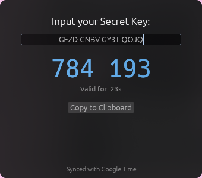

<h1 align="center">Simple TOTP</h1>

<p align="center">
  <strong>A standalone desktop 2FA code generator — one small native binary, no accounts, no cloud.</strong>
</p>

<p align="center">
  
</p>

---

## What is Simple TOTP?

Simple TOTP is a small desktop authenticator: paste in a 2FA secret key and it generates the same 6-digit codes your phone app would, refreshing every 30 seconds. It implements the [RFC 6238](https://datatracker.ietf.org/doc/html/rfc6238) TOTP standard and ships as a single native binary — nothing stored, nothing sent anywhere.

This is the native Rust rewrite of [simple-totp](https://github.com/evol1228/simple-totp) (the Python/tkinter original), built with [egui](https://github.com/emilk/egui) so it runs natively on Wayland and X11.

## Features

- **Real-time code generation** — 6-digit TOTP codes, displayed as `123 456` and refreshed live
- **Network time sync** — Corrects for local clock drift by reading the `Date` header from a single HEAD request to Google, falling back to local time if offline
- **One-click copy** — Click the code itself or press the button to copy it to your clipboard
- **Visual countdown** — Shows seconds remaining and turns red when the code is about to expire
- **Native and lightweight** — A single ~17 MB binary, no Electron, no runtime to install
- **Tested against the RFCs** — `cargo test` checks the HOTP/TOTP output against the official RFC 4226 and RFC 6238 test vectors

## Tech Stack

- **GUI:** [egui / eframe](https://github.com/emilk/egui) (native Wayland + X11)
- **Crypto:** [hmac](https://crates.io/crates/hmac) + [sha1](https://crates.io/crates/sha1) from RustCrypto
- **Base32:** [data-encoding](https://crates.io/crates/data-encoding)
- **Time sync:** [ureq](https://crates.io/crates/ureq) + [httpdate](https://crates.io/crates/httpdate)

## Getting Started

You need a [Rust toolchain](https://rustup.rs). Then:

```bash
# Clone the repo
git clone https://github.com/evol1228/simple-totp-rs.git
cd simple-totp-rs

# Build and run
cargo build --release
./target/release/simple-totp
```

Enter your secret key (Base32 format — spaces are fine, case doesn't matter) and the current code appears immediately.

## Installing as a desktop app (Linux)

To get Simple TOTP in your app launcher like any other application:

```bash
# Install the binary somewhere on your PATH
install -Dm755 target/release/simple-totp ~/.local/bin/simple-totp

# Install the desktop entry and icon
install -Dm644 assets/simple-totp.desktop ~/.local/share/applications/simple-totp.desktop
install -Dm644 assets/icon.svg ~/.local/share/icons/hicolor/scalable/apps/simple-totp.svg
update-desktop-database ~/.local/share/applications
```

It will show up as "Simple TOTP" in rofi, wofi, GNOME, KDE, or whatever launcher you use.

## Getting your secret key

Most services show the raw key when you set up 2FA:

- Look for **"Can't scan the QR code?"** or **"Manual entry"** during setup
- Copy the provided key — usually 16–32 characters using `A–Z` and `2–7`

## How it works

Each 30-second window, the app packs the current Unix time step into bytes, HMAC-SHA1 signs it with your Base32-decoded secret, dynamically truncates the hash per RFC 4226, and takes the result modulo 1,000,000. The status bar tells you whether it's running on synced network time or your local clock.

## License

[MIT](LICENSE) — Use it, modify it, ship it. No strings attached.

---

<p align="center">
  Built by <a href="https://github.com/evol1228">@evol1228</a>
</p>
